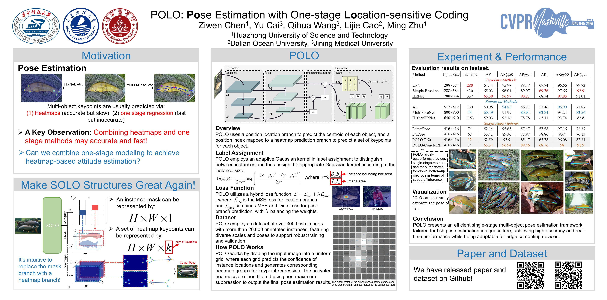

# POLO: Pose Estimation with One-Stage Location-Sensitive Coding (CVPR-2025)

This repository contains the official implementation of our paper:

**[POLO: Pose Estimation with One-Stage Location-Sensitive Coding](https://doi.org/10.1016/j.compag.2024.109384)**  
Accepted at **Computers and Electronics in Agriculture***, 2024 and **CVPR-2025** CV4Animals workshop

---

## 🔍 Overview

**POLO** is a lightweight, single-stage, location-sensitive pose estimation framework designed for multi-object fish pose estimation in aquaculture environments.  
It bypasses traditional Top-down and Bottom-up approaches by directly predicting keypoints per instance from location-aware grids.  

Combined with a simple RNN, POLO can also be used to classify fish behaviors such as swimming, feeding, sleeping, and physical disability, supporting intelligent fish welfare monitoring.

---

## 🚀 Highlights

- 🐟 **Fish-specific Pose Estimation**: Trained on a high-quality fish keypoint dataset.
- ⚡ **Real-Time Inference**: Achieves 71.4 FPS on Tesla V100 and 53 FPS on Jetson Nano with int16 quantization.
- 🧠 **Behavior Recognition Ready**: Output keypoints can be directly used for action classification via RNN.
- 📦 **Edge Deployment Friendly**: Lightweight design suitable for embedded systems and aquaculture IoT devices.

---

## 📁 Dataset

We release the annotated multi-fish keypoint dataset used in the paper.

👉 **[Download the dataset here](https://pan.baidu.com/s/1aR-7eGOOCIeoiIfrgTMO1Q?pwd=t1c4)**

---

## 🖼️ Poster

You can view the summary of our method in the project poster below:



---

## 📄 Paper

You can access the full paper at Elsevier via:

📖 [https://doi.org/10.1016/j.compag.2024.109384](https://doi.org/10.1016/j.compag.2024.109384)


---

## 📜 Citation

If you use POLO or the dataset, please cite:

```bibtex
@article{chen2024polo,
  title={POLO: Pose estimation with one-stage location-sensitive coding},
  author={Chen, Ziwen and Cai, Yu and Wang, Qihua and Cao, Lijie},
  journal={Computers and Electronics in Agriculture},
  volume={226},
  pages={109384},
  year={2024},
  publisher={Elsevier}
}
